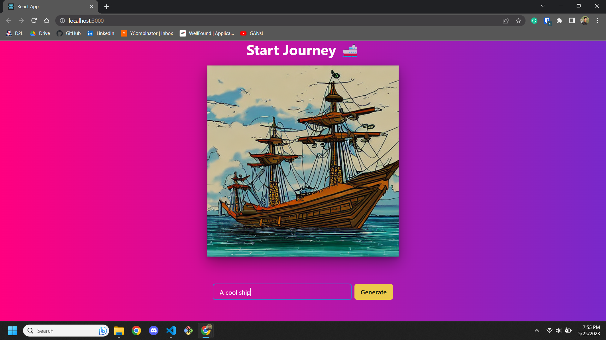

# Start Journey

Image Generation wtih Stable Diffusion in PyTorch, HuggingFace and Diffusers. The model is also exposed via a FastAPI backend and consumed by a frontend written in React.

Note: This project's backend REQUIRES CUDA. If you are tryinig to set this up locally, please make sure to install a version of PyTorch that supports CUDA when installting the requirements. I am using [CUDA 11.8](https://developer.nvidia.com/cuda-11-8-0-download-archive)

## Runing the Backend

If you have CUDA installed (I will assume version 11.8 for the following commands), run the following:

1. Create and activate a Python virtual environment in `start-journey-backend/`
2. Install PyTorch with `pip3 install torch torchvision torchaudio --index-url https://download.pytorch.org/whl/cu118`
3. Install HuggingFace, Diffusers, FastAPI, and Uvicorn `pip install transformers diffusers fastapi uvicorn`
4. In the `start-journey-backend` folder run `uvicorn app:app`. The backend should now be hosted on `localhost:8000`

## Running the FrontEnd

The frontend is a simple react app, so assuming you have the backend running already, to run the frontend, simply run `npm start` in the `start-journey-frontend` folder. The app will be availble on `localhost:3000`.
