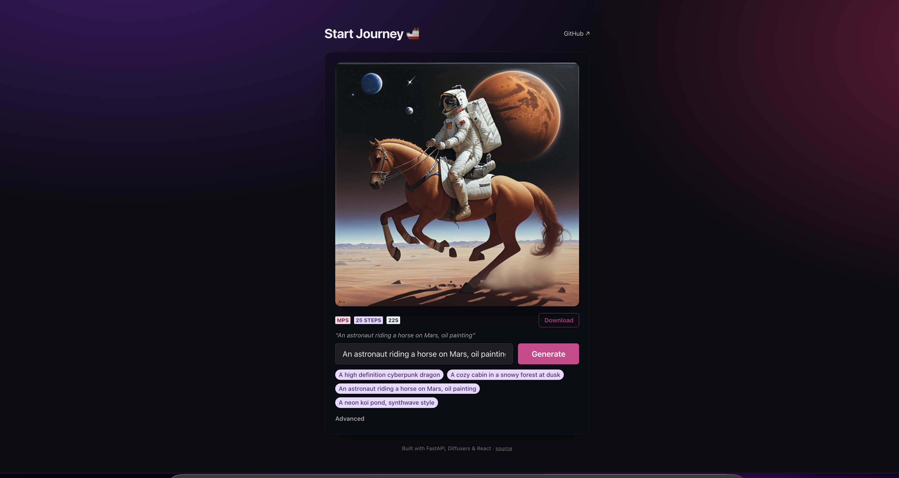

# Start Journey 🚢

[](https://github.com/Adi-UA/start-journey/actions/workflows/ci.yml)
[](./LICENSE)

Type a prompt, get an image. Start Journey is a text-to-image web app that runs
Stable Diffusion behind a FastAPI backend and a React frontend. The backend
serves the built frontend from the same origin, so the whole thing runs locally
as a single app (or one container).

## Examples

| A cozy cabin in a snowy forest at dusk | An astronaut riding a horse on Mars, oil painting | A neon koi pond, synthwave style |
|:---:|:---:|:---:|
|  |  |  |

## How it works

```
Browser ──> /             FastAPI serves the built React app (static files)
Browser ──> /api/generate ──> ImageGenerator ──> Stable Diffusion ──> PNG (base64)
```

One app, one origin. In development the Vite dev server proxies `/api` to the
backend; in production FastAPI serves both the UI and the API, so there is no
CORS to configure.

## Device support

The backend auto-detects hardware and picks the fastest available option. Set
`SJ_DEVICE` to force one.

| Device | Precision | Speed (512px, 25 steps) |
|---|---|---|
| CUDA (NVIDIA GPU) | fp16 | seconds |
| Apple MPS | fp32 | tens of seconds |
| CPU | fp32 | 1-3 minutes |

CPU works but is slow, so a GPU (CUDA) or Apple Silicon (MPS) is recommended for
a responsive experience.

## Run with Docker (optional)

The quickest way to run the whole app with one command:

```bash
docker build -t start-journey .
docker run -p 8000:8000 start-journey
```

Open http://localhost:8000. The first request downloads the model weights
(~4 GB), which are then cached.

## Local development

Run the backend and frontend as two processes; the Vite dev server proxies API
calls to the backend.

**Backend** (in `backend/`):

```bash
python -m venv .venv && source .venv/bin/activate
pip install -r requirements.txt          # full runtime, incl. Stable Diffusion
# NVIDIA GPU? install a CUDA torch build instead:
# pip install torch --index-url https://download.pytorch.org/whl/cu121
uvicorn app:app --reload                  # http://localhost:8000
```

**Frontend** (in `frontend/`):

```bash
npm install
npm run dev                               # http://localhost:5173
```

To run as a single app locally (backend serving the built UI):

```bash
cd frontend && npm run build              # outputs to frontend/dist
cd ../backend && SJ_STATIC_DIR=../frontend/dist uvicorn app:app  # http://localhost:8000
```

## Configuration

All settings are environment variables with the `SJ_` prefix (see
`backend/.env.example`). Every value has a working default.

| Variable | Default | Description |
|---|---|---|
| `SJ_MODEL_ID` | `Lykon/dreamshaper-8` | Hugging Face model id. |
| `SJ_DEVICE` | `auto` | `auto`, `cuda`, `mps`, or `cpu`. |
| `SJ_NUM_INFERENCE_STEPS` | `25` | Denoising steps. |
| `SJ_GUIDANCE_SCALE` | `8.5` | Classifier-free guidance strength. |
| `SJ_IMAGE_SIZE` | `512` | Output width/height in pixels. |
| `SJ_HF_TOKEN` | unset | Token for gated models. |

The frontend reads `VITE_API_BASE` (default empty = same origin). Override only
when the backend runs elsewhere.

## Models

The loader uses Diffusers' `AutoPipelineForText2Image`, so the model is
swappable with just `SJ_MODEL_ID`, no code change:

| Model id | Notes |
|---|---|
| `Lykon/dreamshaper-8` | Default. High-quality SD 1.5 finetune, fast, ungated. |
| `CompVis/stable-diffusion-v1-4` | Lighter/basic baseline. |
| `stabilityai/sdxl-turbo` | Near-instant (1-4 steps). Set `SJ_NUM_INFERENCE_STEPS=4` and `SJ_GUIDANCE_SCALE=1` (Turbo ignores guidance). Ungated. |
| `stabilityai/stable-diffusion-xl-base-1.0` | Best quality, ~7 GB, needs a good GPU; slow on CPU/MPS. |
| `stabilityai/stable-diffusion-2-1` | Gated: `huggingface-cli login`, accept the license on its model page, then set `SJ_HF_TOKEN`. |

Example: `SJ_MODEL_ID=stabilityai/sdxl-turbo uvicorn app:app`.

## API

| Method | Path | Body | Returns |
|---|---|---|---|
| `POST` | `/api/generate` | `{ "prompt": str, "steps"?: int, "guidance_scale"?: float }` | `{ image, device, steps, guidance_scale }` (image is base64 PNG) |
| `POST` | `/api/generate/stream` | same as above | Newline-delimited JSON: a `{"type":"progress","step","total","eta_seconds"}` line per step, then a `{"type":"result","image",...}` line. The UI uses this for the live progress bar. |
| `GET` | `/api/health` | — | `{ status, device, model_id, loaded }` |

## Testing

```bash
# Backend (GPU-free: the pipeline is mocked)
cd backend && pip install -r requirements-dev.txt && ruff check . && pytest

# Frontend
cd frontend && npm ci && npm run build && npm test
```

## Tech stack

Backend: FastAPI, Diffusers, PyTorch, Pydantic. Frontend: React, TypeScript,
Vite, Chakra UI, TanStack Query. Packaging: Docker (multi-stage). CI: GitHub
Actions.

## License

[MIT](./LICENSE)
